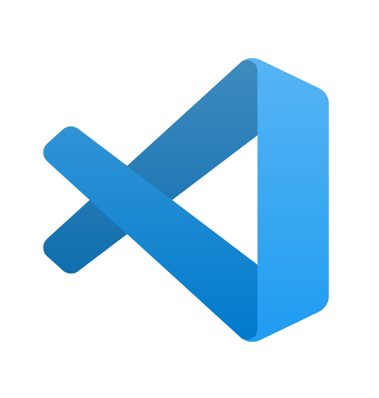
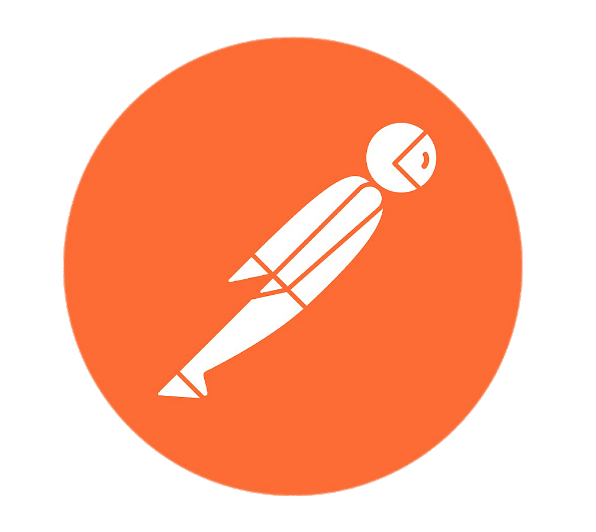

### 👋 Hi there! I'm MilliXPlorer

I'm a tech enthusiast currently exploring web and app development. I enjoy building clean, responsive interfaces and learning new technologies along the way. I'm passionate about solving real-world problems with code and always open to collaboration and feedback.

## 💻 Tech Stack

Languages
<table> <tr> <td align="center"> HTML</td> <td align="center"> CSS</td> <td align="center"> Python</td> <td align="center"> Dart</td> </tr> </table>
Tools
<table> <td align="center"> VS Code</td> <td align="center"> Postman</td> <td align="center"> Eclipse</td> </tr> </table>
Frameworks / Libraries
<table> <tr> <td align="center"> Flutter</td> </tr> </table>

